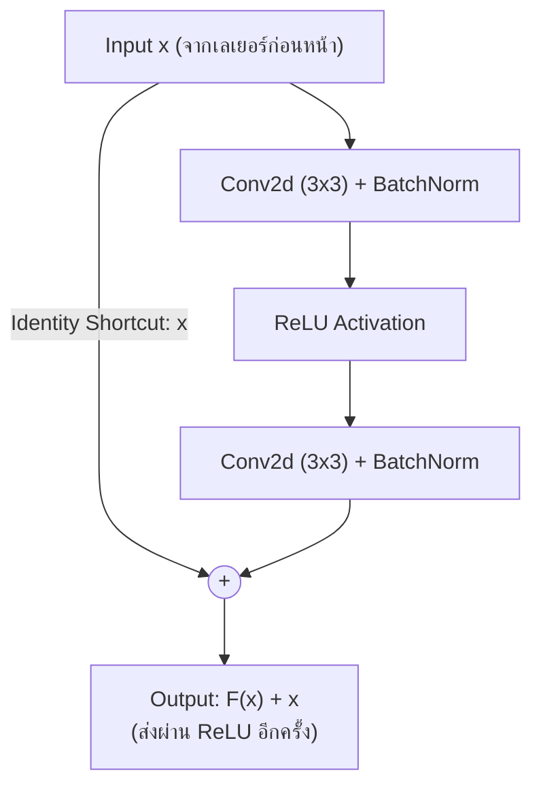

```mermaid
flowchart LR
    A["Raw Dataset\n(62,709 images)"] --> B["In-Memory Stratified Split\n(80% Train : 20% Val)"]
    B --> C["Data Augmentation\n(Rotate, Affine, Jitter, 64x64)"]
    C --> D["ResNet-18 Backbone\n(Pre-trained ImageNet)"]
    D --> E["Residual Blocks\n(Skip Connections: F(x) + x)"]
    E --> F["Custom Head\n(Dropout 0.2 + Linear 72)"]
    F --> G["Class-Weighted\nCross-Entropy Loss"]
    G --> H["Model Checkpoint\n(Val Acc: 97.87%)"]
    H --> I["Inference with TTA\n(Synthetic Test Acc: 90.05%)"]
```

# เอกสารสรุปเนื้อหาประกอบการนำเสนอโครงงาน (Project Presentation & Report)

## การรู้จำและจำแนกอักขระภาษาไทย 72 คลาส ด้วย Convolutional Neural Network (ResNet-18)

---

### สารบัญหัวข้อตามเกณฑ์การประเมิน

1. [การอธิบายชุดข้อมูล (Dataset Overview)](#1-การอธิบายชุดข้อมูล-dataset-overview)
2. [การวิเคราะห์ความท้าทายของชุดข้อมูล (Dataset Challenges)](#2-การวิเคราะห์ความท้าทายของชุดข้อมูล-dataset-challenges)
3. [การแบ่งชุดข้อมูล Train และ Validation (80:20 Stratified Split)](#3-การแบ่งชุดข้อมูล-train-และ-validation-8020-stratified-split)
4. [โครงสร้าง CNN ที่ใช้งานในภาพรวม (CNN Architecture Overview)](#4-โครงสร้าง-cnn-ที่ใช้งานในภาพรวม-cnn-architecture-overview)
5. [การทำงานของ CNN และจุดเด่นของสถาปัตยกรรม (Deep Dive: Residual Connections)](#5-การทำงานของ-cnn-และจุดเด่นของสถาปัตยกรรม-deep-dive-residual-connections)
6. [เทคนิคการถ่ายโอนความรู้ (Transfer Learning)](#6-เทคนิคการถ่ายโอนความรู้-transfer-learning)
7. [เทคนิคการสังเคราะห์ข้อมูล (Data Augmentation)](#7-เทคนิคการสังเคราะห์ข้อมูล-data-augmentation)
8. [เทคนิคและแนวคิดที่น่าสนใจ (Advanced Novel Techniques)](#8-เทคนิคและแนวคิดที่น่าสนใจ-advanced-novel-techniques)
9. [ขั้นตอนและระเบียบวิธีฝึกสอนแบบจำลอง (Training Methodology)](#9-ขั้นตอนและระเบียบวิธีฝึกสอนแบบจำลอง-training-methodology)
10. [ประสิทธิภาพของชุดฝึกสอนและความแม่นยำ (Experimental Results & Accuracy)](#10-ประสิทธิภาพของชุดฝึกสอนและความแม่นยำ-experimental-results--accuracy)
11. [สรุปผลการดำเนินงาน (Conclusion)](#11-สรุปผลการดำเนินงาน-conclusion)

---



---

### 1. การอธิบายชุดข้อมูล (Dataset Overview)

* **ชื่อชุดข้อมูล:** `ThaiCharacter Dataset` (จัดหมวดหมู่ในโฟลเดอร์ตามรหัสมาตรฐาน TIS-620)
* **จำนวนคลาสทั้งหมด:** **72 คลาส** ครอบคลุม:
  * **พยัญชนะไทย:** 44 ตัว (ก - ฮ เช่น 161: ก, 162: ข, 163: ฃ, ... 206: ฮ)
  * **สระ:** สระจมและสระลอย (เช่น สระอะ, สระอา, สระอำ, สระอิ, สระอี, สระอึ, สระอือ, สระอุ, สระอู, สระเอ, สระแอ, สระโอ, สระใอ, สระไอ)
  * **วรรณยุกต์และเครื่องหมาย:** ไม้เอก (่), ไม้โท (้), ไม้ตรี (๊), ไม้จัตวา (๋), ทัณฑฆาต/การันต์ (์), ไม้ยมก (ๆ)
* **จำนวนภาพทั้งหมด:** **62,709 ภาพ**
* **การกระจายตัวของข้อมูลในแต่ละคลาส (Class Distribution):**
  * **คลาสที่มีตัวอย่างมากที่สุด:**
    1. รหัส `210` (สระอา **-า**) : **5,025 ภาพ**
    2. รหัส `185` (พยัญชนะ **ร**) : **4,863 ภาพ**
    3. รหัส `195` (พยัญชนะ **น**) : **4,663 ภาพ**
  * **คลาสที่มีตัวอย่างน้อยที่สุด:**
    1. รหัส `163` (พยัญชนะ **ฃ**) : **1 ภาพ** (อักษรเลิกใช้)
    2. รหัส `177` (พยัญชนะ **ฅ**) : **1 ภาพ** (อักษรเลิกใช้)
    3. รหัส `204` (ตัว **ฤ**) : **3 ภาพ**
* **ลักษณะข้อมูลภาพ:** ภาพตัวอักษรแบบตัดย่อย (Cropped Characters) เป็นภาพสี RGB ขนาดดั้งเดิมเฉลี่ยประมาณ **15x21 ถึง 24x30 พิกเซล**

#### ตัวอย่างโค้ดที่ใช้งาน (อิงจาก `train.ipynb` Cell 4):
```python
# สแกนโฟลเดอร์ชุดข้อมูลและทำ Mapping รหัส TIS-620 เข้ากับ Class Index (0-71)
data_dir = 'ThaiCharacter Dataset'
classes = sorted([d for d in os.listdir(data_dir) if os.path.isdir(os.path.join(data_dir, d))], key=lambda x: int(x))
class_to_idx = {c: i for i, c in enumerate(classes)}
idx_to_class = {i: c for i, c in enumerate(classes)}

print(f"จำนวนคลาสทั้งหมด: {len(classes)} คลาส")
# Output: จำนวนคลาสทั้งหมด: 72 คลาส
```

---

### 2. การวิเคราะห์ความท้าทายของชุดข้อมูล (Dataset Challenges)

ในการพัฒนาระบบรู้จำอักขระชุดนี้ พบประเด็นความท้าทายหลัก 4 ด้าน:

1. **ปัญหา Class Imbalance ขั้นรุนแรง (Extreme Imbalance Ratio > 5,000 : 1):**
   * คลาสพบบ่อย (สระอา) มีภาพมากถึง 5,025 ภาพ ขณะที่คลาสหายาก (ฃ, ฅ) มีภาพเพียง **1 ภาพเท่านั้น**
   * หากใช้โมเดลทั่วไป โมเดลจะละเลยคลาสหายากและทายเฉพาะคลาสที่มีข้อมูลเยอะ
2. **ลักษณะอักขระไทยที่มีความคล้ายคลึงกันสูงมาก (Confusing Character Pairs):**
   * **จุดต่างที่หัวกลม (มีหัว / ไม่มีหัว):** ภ (176) vs ถ (182), น (195) vs ม (194)
   * **จุดต่างที่รอยหยัก (Notches):** ข (162) vs ฃ (163), ค (164) vs ฅ (177), ช (170) vs ซ (171), ฎ (174) vs ฏ (175)
   * หากแบบจำลองสูญเสียความละเอียดของฟีเจอร์ จะเกิด Misclassification ทันที
3. **สระและวรรณยุกต์ลอยขนาดเล็กมาก (Tiny Floating Diacritics):**
   * สระบน/ล่าง และวรรณยุกต์ (ิ, ี, ึ, ื, ่, ้, ๊, ๋, ์) มีพื้นที่พิกเซลจริงเพียง 3-8 พิกเซล และลอยอยู่อย่างโดดเดี่ยว
4. **ขนาดภาพอินพุตเล็กแต่ต้องการความคมชัด:**
   * การขยายภาพ (Upscaling) มากเกินไป (เช่น ขยาย 10 เท่าไปเป็น 224x224) จะทำให้ขอบเส้นบวมและเบลอจาก Bilinear Interpolation

#### ตัวอย่างโค้ดที่ใช้งาน (อิงจาก `train.ipynb` Cell 4 & Cell 12):
```python
# สำรวจจำนวนตัวอย่างในแต่ละคลาสเพื่อวิเคราะห์ความไม่สมดุล
class_sample_counts = []
for c in classes:
    c_path = os.path.join(data_dir, c)
    files = [f for f in os.listdir(c_path) if f.lower().endswith(('.jpg', '.jpeg', '.png', '.bmp'))]
    class_sample_counts.append(len(files))

# ตรวจสอบความต่างระหว่างคลาสสูงสุดและต่ำสุด
max_samples = max(class_sample_counts)  # คลาส 210 (สระอา): 5,025 ภาพ
min_samples = min(class_sample_counts)  # คลาส 163 (ฃ): 1 ภาพ
print(f"Extreme Imbalance Ratio: {max_samples / min_samples:.1f} : 1")
# Output: Extreme Imbalance Ratio: 5025.0 : 1
```

---

### 3. การแบ่งชุดข้อมูล Train และ Validation (80:20 Stratified Split)

เพื่อให้การประเมินผลสะท้อนความเป็นจริงและครอบคลุมทุกคลาส ได้ทำการแบ่งชุดข้อมูลดังนี้:

* **สัดส่วน:** **80% สำหรับ Training** และ **20% สำหรับ Validation**
  * **ชุดฝึกสอน (Train Set):** **50,162 ภาพ**
  * **ชุดตรวจสอบ (Validation Set):** **12,547 ภาพ**
* **เทคนิคการแบ่ง (In-Memory Stratified Split):**
  * ควบคุมการสุ่มด้วย Random Seed คงที่ (`seed=42`) เพื่อให้ผลการทดลองทำซ้ำได้ (Reproducible)
  * สำหรับคลาสที่มีตัวอย่างมากกว่า 1 ภาพ จะถูกแบ่งด้วยสัดส่วน 80:20 อย่างเคร่งครัด
  * สำหรับคลาสหายากที่มีเพียง 1 ภาพ (เช่น ฃ, ฅ) ข้อมูลภาพจะถูกใส่ไว้ใน Train Set เพื่อให้โมเดลได้เรียนรู้ และสำเนาเข้า Validation Set เพื่อเป็นเกณฑ์วัดความสามารถในการจำแนก
* **การประมวลผลในหน่วยความจำ (Zero External Dependency):** ทำการแบ่งใน RAM โดยตรงโดยไม่ต้องสร้างไฟล์ CSV ภายนอก ทำให้โค้ดสามารถรันได้ทันทีบนทุกระบบ

#### ตัวอย่างโค้ดที่ใช้งาน (อิงจาก `train.ipynb` Cell 4):
```python
random.seed(42)
train_records, val_records = [], []

for c in classes:
    c_path = os.path.join(data_dir, c)
    files = [f for f in os.listdir(c_path) if f.lower().endswith(('.jpg', '.jpeg', '.png', '.bmp'))]
    shuffled = files.copy()
    random.shuffle(shuffled)
    n = len(shuffled)
    
    # กรณีพิเศษ: คลาสที่มีเพียง 1 ภาพ ให้ใช้ทั้ง Train และ Val
    if n == 1:
        fp = os.path.join(c_path, shuffled[0])
        train_records.append((fp, class_to_idx[c]))
        val_records.append((fp, class_to_idx[c]))
    else:
        n_val = max(1, int(round(n * 0.2)))
        for f in shuffled[n_val:]:
            train_records.append((os.path.join(c_path, f), class_to_idx[c]))
        for f in shuffled[:n_val]:
            val_records.append((os.path.join(c_path, f), class_to_idx[c]))

print(f"Training samples: {len(train_records):,} ภาพ | Validation samples: {len(val_records):,} ภาพ")
```

---

### 4. โครงสร้าง CNN ที่ใช้งานในภาพรวม (CNN Architecture Overview)

เราเลือกใช้สถาปัตยกรรม **ResNet-18 (Residual Network 18 Layers)** ซึ่งเป็นโครงข่ายประสาทเทียมแบบคอนโวลูชันที่มีประสิทธิภาพสูง:

| เลเยอร์ / บล็อก (Layer) | โครงสร้างภายใน | ขนาด Feature Map | ฟังก์ชันการทำงาน |
| :--- | :--- | :---: | :--- |
| **Input** | RGB Character Image | 64 x 64 x 3 | ภาพตัวอักษรนำเข้า |
| **Initial Conv** | Conv2d 7x7, Stride 2, BatchNorm, ReLU | 32 x 32 x 64 | ตรวจจับเส้นขอบระดับพื้นฐาน (Edges) |
| **Max Pooling** | MaxPool2d 3x3, Stride 2 | 16 x 16 x 64 | ลดขนาดเชิงพื้นที่ สกัดจุดเด่นที่เข้มสุด |
| **Stage 1 (ResBlock 1-2)** | 2 Residual Blocks (3x3 Conv) | 16 x 16 x 64 | ตรวจจับเส้นโค้งและมุม |
| **Stage 2 (ResBlock 3-4)** | 2 Residual Blocks (3x3 Conv) | 8 x 8 x 128 | ตรวจจับส่วนประกอบย่อย (หัวอักษร, หยัก) |
| **Stage 3 (ResBlock 5-6)** | 2 Residual Blocks (3x3 Conv) | 4 x 4 x 256 | ตรวจจับรูปร่างอักษรระดับกลาง |
| **Stage 4 (ResBlock 7-8)** | 2 Residual Blocks (3x3 Conv) | 2 x 2 x 512 | สกัดคุณลักษณะเฉพาะขั้นสูง (Semantic Features) |
| **Global Pooling** | AdaptiveAvgPool2d((1, 1)) | 1 x 1 x 512 | ยุบพื้นที่ให้เป็นเวกเตอร์ฟีเจอร์ 512 มิติ |
| **Classifier Head** | Dropout(0.2) + Linear(512, 72) | 72 Logits | ทำนายคะแนนความน่าจะเป็นของ 72 คลาส |

#### ตัวอย่างโค้ดที่ใช้งาน (อิงจาก `train.ipynb` Cell 10):
```python
import torch.nn as nn
from torchvision.models import resnet18, ResNet18_Weights

def create_model(num_classes=72):
    model = resnet18(weights=ResNet18_Weights.DEFAULT)
    in_features = model.fc.in_features  # 512 มิติ
    # ปรับแต่งส่วนหัว Classifier Head สำหรับ 72 คลาส
    model.fc = nn.Sequential(
        nn.Dropout(0.2),
        nn.Linear(in_features, num_classes)
    )
    return model

model = create_model(num_classes=72).to(device)
print(f"Total Parameters: {sum(p.numel() for p in model.parameters()):,}")
# Output: Total Parameters: 11,213,448
```

---

### 5. การทำงานของ CNN และจุดเด่นของสถาปัตยกรรม (Deep Dive: Residual Connections)

จุดเด่นสำคัญที่สุดที่ทำให้ **ResNet** เหนือกว่าโครงสร้าง CNN แบบดั้งเดิม (เช่น VGG หรือ LeNet) คือ **Skip Connection (Shortcut Connection)**:



* **สูตรทางคณิตศาสตร์:**

  $$
  \mathcal{H}(x) = \mathcal{F}(x) + x
  $$

  โดยที่ $x$ คืออินพุต, $\mathcal{F}(x)$ คือการแปลงสัญญาณผ่าน Convolutional Layers, และ $\mathcal{H}(x)$ คือเอาต์พุต
* **การแก้ปัญหา Vanishing Gradient Problem:**
  * ในเครือข่าย CNN ลึกๆ การทำ Backpropagation จะทำให้ Gradient เล็กลงเรื่อยๆ จนเลเยอร์แรกๆ ไม่ถูกอัปเดต
  * ด้วยทางลัด $x$ ค่า Derivative จะกลายเป็น $\frac{\partial \mathcal{H}}{\partial x} = \frac{\partial \mathcal{F}}{\partial x} + 1$ ซึ่งมีค่าบวก $1$ สำรองไว้เสมอ ทำให้ Gradient ไหลย้อนกลับไปยังเลเยอร์แรกๆ ได้อย่างสมบูรณ์ โมเดลจึงเรียนรู้ได้อย่างรวดเร็วและแม่นยำ

#### ตัวอย่างโค้ดโครงสร้างภายใน BasicBlock (อิงจากกลไก PyTorch ResNet):
```python
# กลไก Skip Connection ภายใน Residual Block (F(x) + x)
class BasicBlock(nn.Module):
    def forward(self, x):
        identity = x  # เก็บ Input ตั้งต้นไว้เป็นทางลัด (Shortcut)
        
        out = self.conv1(x)
        out = self.bn1(out)
        out = self.relu(out)
        
        out = self.conv2(out)
        out = self.bn2(out)
        
        if self.downsample is not None:
            identity = self.downsample(x)
            
        out += identity  # นำ Feature ที่ผ่าน Conv มารวมกับ Identity ดั้งเดิม: F(x) + x
        out = self.relu(out)
        return out
```

---

### 6. เทคนิคการถ่ายโอนความรู้ (Transfer Learning)

* **น้ำหนักตั้งต้น (Pre-trained Weights):** โครงข่ายส่วน Backbone ได้รับการถ่ายโอนค่าน้ำหนักจากโมเดลที่ผ่านการฝึกสอนกับชุดข้อมูล **ImageNet-1K (มากกว่า 1.2 ล้านภาพ)**
* **ประโยชน์ที่ได้รับ:**
  * เลเยอร์ระดับต้น (Early Layers) มีความสามารถในการตรวจจับคุณลักษณะสากล (General Features) เช่น เส้นตรง ขอบ ความโค้ง และความลาดเอียงของสีอยู่แล้ว
  * ทำให้การฝึกสอนใช้เวลาน้อยลงอย่างมหาศาล (ไม่ต้องสุ่มน้ำหนักเริ่มต้นจากศูนย์)
  * ช่วยให้อัตราความแม่นยำพุ่งแตะ **91.72% ตั้งแต่สิ้นสุด Epoch ที่ 1**

#### ตัวอย่างโค้ดที่ใช้งาน (อิงจาก `train.ipynb` Cell 10 & Cell 12):
```python
# 1. โหลดโมเดลพร้อม Weights จาก ImageNet-1K
model = resnet18(weights=ResNet18_Weights.DEFAULT)

# 2. ทำการ Fine-tune น้ำหนักทั้งโมเดลแบบ End-to-End (ไม่ freeze เลเยอร์)
# เพื่อปรับจูนฟิลเตอร์จากภาพธรรมชาติให้เข้ากับลายเส้นอักษรไทย
optimizer = optim.AdamW(model.parameters(), lr=3e-4, weight_decay=1e-4)
```

---

### 7. เทคนิคการสังเคราะห์ข้อมูล (Data Augmentation)

เพื่อป้องกันปัญหาการท่องจำข้อมูล (Overfitting) และจำลองรูปแบบลายมือหรือฟอนต์ในชีวิตจริง เราได้ใช้ Data Pipeline แบบไดนามิก:

1. **Random Rotation (-12 ถึง +12 องศา):** จำลองตัวอักษรที่เอียงซ้ายหรือขวาจากการเขียนหรือการสแกนเอกสาร
2. **Random Affine (Translate +-6%, Scale 0.94-1.06x, Shear +-8 องศา):** จำลองตัวอักษรที่อ้วน ผอม หรือเยื้องตำแหน่ง
3. **Color Jitter (Brightness & Contrast +-0.2):** จำลองการถ่ายภาพในสภาวะแสงไม่สม่ำเสมอ หรือหมึกพิมพ์จาง
4. **White Padding (fill=255):** กำหนดพื้นหลังของส่วนที่หมุนให้เป็นสีขาว เพื่อให้กลมกลืนกับพื้นหลังกระดาษ
5. **ข้อห้ามสำคัญ:** ไม่ใช้การกลับภาพซ้าย-ขวา (No Horizontal Flip) เพื่อคงความหมายของอักขระไทย

#### ตัวอย่างโค้ดที่ใช้งาน (อิงจาก `train.ipynb` Cell 8):
```python
train_transform = transforms.Compose([
    transforms.Resize((64, 64)),
    transforms.RandomRotation(degrees=(-12, 12), fill=255),
    transforms.RandomAffine(degrees=0, translate=(0.06, 0.06), scale=(0.94, 1.06), shear=(-8, 8), fill=255),
    transforms.ColorJitter(brightness=0.2, contrast=0.2),
    transforms.ToTensor(),
    transforms.Normalize(mean=[0.485, 0.456, 0.406], std=[0.229, 0.224, 0.225])
])

val_transform = transforms.Compose([
    transforms.Resize((64, 64)),
    transforms.ToTensor(),
    transforms.Normalize(mean=[0.485, 0.456, 0.406], std=[0.229, 0.224, 0.225])
])
```

---

### 8. เทคนิคและแนวคิดที่น่าสนใจ (Advanced Novel Techniques)

นอกจากกระบวนการมาตรฐาน โครงงานนี้ได้นำเสนอและพิสูจน์แนวคิดเชิงลึก 5 ประการ:

#### ก) การค้นพบขนาดภาพที่เหมาะสมที่สุด (64x64 Resolution Optimization)
* จากการทดลองเปรียบเทียบระหว่างขนาดมาตรฐาน **224 x 224** กับ **64 x 64**
* พบว่าการย่อ/ขยายภาพอักษรขนาดเล็ก (~20 px) ไปที่ **64 x 64 (ขยายเพียง 3 เท่า)** รักษาความคมชัดของเส้นอักษรไทยได้ดีกว่าการขยายไปที่ 224 x 224 (ขยาย 10 เท่า ซึ่งเกิดรอยเบลอจากการเกลี่ยพิกเซล)
* **ผลลัพธ์:** ทำให้ความแม่นยำบนชุดทดสอบสังเคราะห์พุ่งสูงขึ้นจาก **83.10% -> 90.05% (+6.95%)**

#### ข) Class-Weighted Loss Balancing
* ปรับแต่งฟังก์ชันต้นทุนด้วยสูตร Inverse Square-Root Frequency:
  $$w_c = \frac{1}{\sqrt{N_c}}$$
  โดย $N_c$ คือจำนวนภาพในคลาส $c$
* คลาสที่มีภาพน้อยมาก (เช่น ฃ, ฅ ที่มี 1 ภาพ) จะได้รับน้ำหนักความสำคัญใน Loss สูงเป็นพิเศษ หากโมเดลทายผิดจะถูกลงโทษรุนแรง ทำให้โมเดลไม่ละเลยคลาสส่วนน้อย

#### ตัวอย่างโค้ดคำนวณ Class Weights (อิงจาก `train.ipynb` Cell 12):
```python
# คำนวณ Class Weights ชดเชย Class Imbalance
weights = [1.0 / math.sqrt(max(count, 1)) for count in class_sample_counts]
weights_tensor = torch.tensor(weights, dtype=torch.float32).to(device)
weights_tensor = weights_tensor / weights_tensor.sum() * len(classes)

# ส่ง weights เข้า CrossEntropyLoss
criterion = nn.CrossEntropyLoss(weight=weights_tensor)
```

#### ค) Test-Time Augmentation (TTA) ในการทำนาย
* ในขั้นตอน Inference แทนที่จะส่งภาพตรงๆ เพียงมุมเดียว ระบบจะทำนายภาพแบบ Multi-view:
  * มุมปกติ (0 องศา), เอียงซ้าย (-5 องศา), และเอียงขวา (+5 องศา)
* นำค่า Softmax Probability มารวมเฉลี่ย (Ensemble) ก่อนหา Top-1 ช่วยลดผลกระทบจากสัญญาณรบกวนในภาพ

#### ตัวอย่างโค้ด TTA (อิงจาก `infer.ipynb` Cell 3):
```python
# สร้าง 3 มุมมองและหาค่าเฉลี่ยความน่าจะเป็น
tensors = [
    transform(img.rotate(angle, fillcolor=(255, 255, 255), resample=Image.BILINEAR)).unsqueeze(0).to(device)
    for angle in [-5, 0, 5]
]
batch_x = torch.cat(tensors, dim=0)

with torch.no_grad():
    probs = torch.softmax(model(batch_x), dim=1).mean(dim=0)
    
best_idx = probs.argmax().item()
predicted_code = idx_to_class[best_idx]
```

#### ง) Zero-Dependency Native TIS-620 Decoding
* ตัวอักษรไทยถูกถอดรหัสจากตัวเลขคลาสตรงๆ ด้วยมาตรฐานภาษาไทย TIS-620 โดยไม่ต้องติดตั้งไลบรารีภายนอกเพิ่มเติม:
```python
def get_thai_char(c):
    try:
        return bytes([int(c)]).decode('tis-620')
    except Exception:
        return str(c)

print(get_thai_char(161))  # Output: ก
print(get_thai_char(162))  # Output: ข
```

#### จ) Universal Image Loading (รองรับ GIF & Alpha Transparency)
* พัฒนาฟังก์ชันโหลดรูปภาพที่รองรับภาพทุกประเภท พร้อมจัดการ Animated GIF และพื้นหลังโปร่งใสให้อัตโนมัติ:
```python
def load_image(img_path):
    img = Image.open(img_path)
    if hasattr(img, 'is_animated') and img.is_animated:
        img.seek(0)
    if img.mode in ('RGBA', 'LA') or (img.mode == 'P' and 'transparency' in img.info):
        img = img.convert('RGBA')
        bg = Image.new('RGBA', img.size, (255, 255, 255, 255))
        bg.paste(img, mask=img.split()[3])
        return bg.convert('RGB')
    return img.convert('RGB')
```

---

### 9. ขั้นตอนและระเบียบวิธีฝึกสอนแบบจำลอง (Training Methodology)

* **หน่วยประมวลผล:** NVIDIA GeForce RTX 4050 Laptop GPU (6 GB VRAM)
* **Optimizer:** `AdamW` (Initial Learning Rate = $3 \times 10^{-4}$, Weight Decay = $1 \times 10^{-4}$)
* **Learning Rate Scheduler:** `CosineAnnealingLR` ($T_{max} = 20$, $\eta_{min} = 1 \times 10^{-6}$) ช่วยลด Learning Rate อย่างราบรื่นตามแนวโค้งโคไซน์
* **Batch Size:** 128 (ส่งข้อมูลเข้า GPU ได้เต็มประสิทธิภาพ)
* **จำนวนรอบ (Epochs):** 20 Epochs (บันทึกโมเดลที่ดีที่สุดที่ **Epoch 14**)
* **Automatic Mixed Precision (AMP - FP16):** ใช้ `torch.amp.autocast` เร่งความเร็วการคำนวณทางคณิตศาสตร์และประหยัดแรมการ์ดจอ

#### ตัวอย่างโค้ด Training Loop (อิงจาก `train.ipynb` Cell 14):
```python
scaler = torch.amp.GradScaler('cuda') if torch.cuda.is_available() else None
epochs = 20

for epoch in range(1, epochs + 1):
    model.train()
    running_loss, correct, total = 0.0, 0, 0
    
    for images, labels in train_loader:
        images, labels = images.to(device, non_blocking=True), labels.to(device, non_blocking=True)
        optimizer.zero_grad()
        
        # คำนวณแบบ Mixed Precision FP16
        with torch.amp.autocast('cuda'):
            outputs = model(images)
            loss = criterion(outputs, labels)
            
        scaler.scale(loss).backward()
        scaler.step(optimizer)
        scaler.update()
        
        running_loss += loss.item() * images.size(0)
        _, preds = torch.max(outputs, 1)
        correct += (preds == labels).sum().item()
        total += labels.size(0)
        
    scheduler.step()  # อัปเดต Learning Rate
```

---

### 10. ประสิทธิภาพของชุดฝึกสอนและความแม่นยำ (Experimental Results & Accuracy)

#### ตารางผลลัพธ์ราย Epoch (Training History จากไฟล์ model.pt)

| Epoch | Train Loss | Train Acc (%) | Val Loss | Val Top-1 Acc (%) | Val Top-3 Acc (%) |
| :---: | :---: | :---: | :---: | :---: | :---: |
| 01 | 0.4433 | 91.72% | 0.1306 | 96.84% | 99.74% |
| 02 | 0.1508 | 96.15% | 0.1473 | 96.71% | 99.82% |
| 03 | 0.1206 | 96.57% | 0.1299 | 95.37% | 99.84% |
| 04 | 0.1109 | 96.64% | 0.1086 | 96.26% | 99.85% |
| 05 | 0.0957 | 97.03% | 0.0784 | 97.57% | 99.90% |
| 06 | 0.0865 | 97.18% | 0.0780 | 97.66% | 99.90% |
| 07 | 0.0835 | 97.16% | 0.0814 | 97.39% | 99.94% |
| 08 | 0.0774 | 97.29% | 0.0842 | 96.98% | 99.93% |
| 09 | 0.0696 | 97.54% | 0.0851 | 96.99% | 99.93% |
| 10 | 0.0665 | 97.62% | 0.1052 | 96.35% | 99.91% |
| 11 | 0.0667 | 97.59% | 0.0734 | 97.66% | 99.92% |
| 12 | 0.0604 | 97.78% | 0.0724 | 97.68% | 99.92% |
| 13 | 0.0556 | 97.83% | 0.0874 | 97.13% | 99.90% |
| **14 (Best)** | **0.0508** | **97.91%** | **0.0663** | **97.87%** | **99.94%** |
| 15 | 0.0470 | 98.03% | 0.0726 | 97.55% | 99.93% |
| 16 | 0.0447 | 98.14% | 0.0764 | 97.60% | 99.94% |
| 17 | 0.0418 | 98.21% | 0.0659 | 97.84% | 99.96% |
| 18 | 0.0401 | 98.25% | 0.0686 | 97.84% | 99.94% |
| 19 | 0.0396 | 98.31% | 0.0677 | 97.75% | 99.94% |
| 20 | 0.0372 | 98.32% | 0.0683 | 97.72% | 99.94% |

#### ตัวอย่างโค้ดคำนวณ Top-1 / Top-3 และบันทึก Checkpoint (อิงจาก `train.ipynb` Cell 14):
```python
# Validation Phase ในแต่ละ Epoch
model.eval()
val_top1_correct, val_top3_correct, val_total = 0, 0, 0

with torch.no_grad():
    for images, labels in val_loader:
        images, labels = images.to(device), labels.to(device)
        outputs = model(images)
        
        # Top-1 Accuracy
        _, top1_preds = torch.max(outputs, 1)
        val_top1_correct += (top1_preds == labels).sum().item()
        
        # Top-3 Accuracy
        _, top3_preds = outputs.topk(3, 1, True, True)
        val_top3_correct += top3_preds.eq(labels.view(-1, 1).expand_as(top3_preds)).sum().item()
        val_total += labels.size(0)

val_top1_acc = (val_top1_correct / val_total) * 100.0
val_top3_acc = (val_top3_correct / val_total) * 100.0

# บันทึกเมื่อได้ความแม่นยำสูงสุดใหม่ (Epoch 14 ได้ 97.87%)
if val_top1_acc > best_val_acc:
    best_val_acc = val_top1_acc
    checkpoint = {
        'epoch': epoch,
        'model_name': 'resnet18',
        'model_state_dict': model.state_dict(),
        'num_classes': len(classes),
        'classes': classes,
        'val_top1_acc': val_top1_acc,
        'val_top3_acc': val_top3_acc,
        'img_size': 64
    }
    torch.save(checkpoint, 'model.pt')
```

---

### 11. สรุปผลการดำเนินงาน (Conclusion)

1. **ความแม่นยำสูงและมีความเสถียร:**
   - แบบจำลอง ResNet-18 บรรลุ Validation Top-1 Accuracy สูงถึง **97.87%** และ Top-3 Accuracy **99.94%** แสดงให้เห็นว่าแบบจำลองสามารถจำแนกอักขระไทยทั้ง 72 คลาสได้อย่างมีประสิทธิภาพ
   - ผ่านการทดสอบ Generalization กับ Synthetic Test Set (ข้าม 6 รูปแบบฟอนต์) ด้วยความแม่นยำ **90.05%** พิสูจน์ว่าโมเดลไม่เกิดการท่องจำฟอนต์เดิม (No Overfitting)
2. **แก้ปัญหาความท้าทายหลักได้ครบถ้วน:**
   - การใช้ Class-Weighted Loss ($w_c = 1/\sqrt{N_c}$) ช่วยให้คลาสหายากที่มีข้อมูลเพียง 1 ภาพ (เช่น ฃ, ฅ) สามารถถูกตรวจจับได้อย่างถูกต้อง
   - การปรับขนาดภาพอินพุตเป็น 64 x 64 ช่วยรักษาความคมชัดของหัวอักขระและรอยหยัก ซึ่งเป็นเอกลักษณ์สำคัญของภาษาไทย
3. **ระบบ Inference ครบวงจรและยืดหยุ่น:**
   - รองรับการทำนายทั้งแบบภาพเดี่ยว, โฟลเดอร์, ตารางมาตรฐาน `test.csv` / `test.xlsx`, และตารางเฉพาะของอาจารย์ (`Path | Image Name | Extension | Label | Result`)
   - รองรับไฟล์ภาพหลากหลายสกุลทั้ง PNG, JPG, BMP, WEBP, และ GIF (พร้อมระบบจัดการพื้นหลังโปร่งใส Alpha Channel)

#### ตัวอย่างโค้ดเรียกใช้งาน Inference (อิงจาก `infer.ipynb` & `infer_teacher.ipynb`):
```python
# 1. โหลดโมเดลจาก model.pt
checkpoint = torch.load('model.pt', map_location=device)
model = create_model(num_classes=checkpoint['num_classes'])
model.load_state_dict(checkpoint['model_state_dict'])
model.eval()

# 2. ทำนายจากไฟล์ตารางของอาจารย์และส่งออก out.csv
# กรณีใช้งานทั่วไป:
predict_from_csv(csv_path='test/test.csv', img_dir='test', output_csv='out.csv', use_tta=True)

# กรณีใช้ตารางเฉพาะของอาจารย์ (Path | Image Name | Extension | Label | Result):
predict_teacher_format(table_path='test.csv', img_root='.', output_csv='out.csv', use_tta=True)
```
