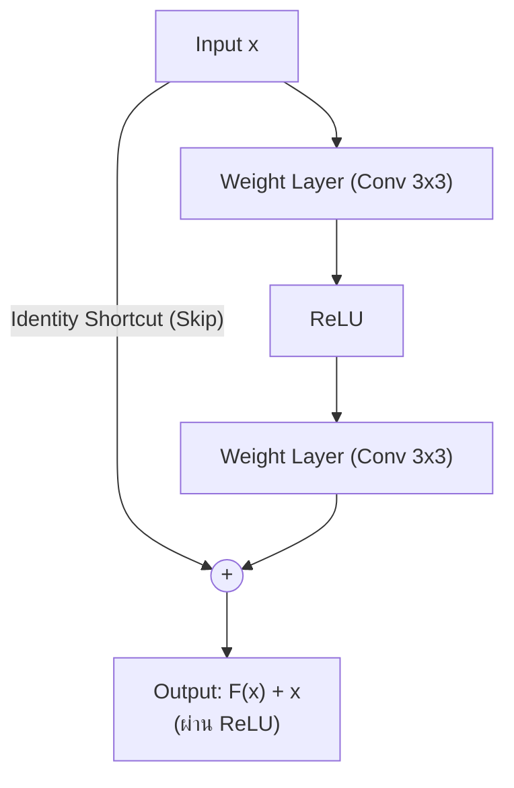

# เอกสารสรุปเนื้อหาประกอบการนำเสนอโครงงาน (Project Presentation & Report)

## การรู้จำและจำแนกอักขระภาษาไทย 72 คลาส ด้วย Convolutional Neural Network (ResNet-18)

---

### สารบัญหัวข้อตามเกณฑ์การประเมิน

1. [การอธิบายชุดข้อมูล (Dataset Overview)](#1-การอธิบายชุดข้อมูล-dataset-overview)
2. [การวิเคราะห์ความท้าทายของชุดข้อมูล (Dataset Challenges)](#2-การวิเคราะห์ความท้าทายของชุดข้อมูล-dataset-challenges)
3. [การแบ่งชุดข้อมูล Train และ Validation (80:20 Stratified Split)](#3-การแบ่งชุดข้อมูล-train-และ-validation-8020-stratified-split)
4. [โครงสร้าง CNN ที่ใช้งานในภาพรวม (CNN Architecture Overview)](#4-โครงสร้าง-cnn-ที่ใช้งานในภาพรวม-cnn-architecture-overview)
5. [การทำงานของ CNN และจุดเด่นของสถาปัตยกรรม (Deep Dive: Residual Connections)](#5-การทำงานของ-cnn-และจุดเด่นของสถาปัตยกรรม-deep-dive-residual-connections)
6. [เทคนิคการถ่ายโอนความรู้ (Transfer Learning)](#6-เทคนิคการถ่ายโอนความรู้-transfer-learning)
7. [เทคนิคการสังเคราะห์ข้อมูล (Data Augmentation)](#7-เทคนิคการสังเคราะห์ข้อมูล-data-augmentation)
8. [เทคนิคและแนวคิดที่น่าสนใจ (Advanced Novel Techniques)](#8-เทคนิคและแนวคิดที่น่าสนใจ-advanced-novel-techniques)
9. [ขั้นตอนและระเบียบวิธีฝึกสอนแบบจำลอง (Training Methodology)](#9-ขั้นตอนและระเบียบวิธีฝึกสอนแบบจำลอง-training-methodology)
10. [ประสิทธิภาพของชุดฝึกสอนและความแม่นยำ (Experimental Results &amp; Accuracy)](#10-ประสิทธิภาพของชุดฝึกสอนและความแม่นยำ-experimental-results--accuracy)
11. [สรุปผลและข้อเสนอแนะในการนำไปใช้งานจริง (Conclusion &amp; Future Work)](#11-สรุปผลและข้อเสนอแนะในการนำไปใช้งานจริง-conclusion--future-work)

---


---

### 1. การอธิบายชุดข้อมูล (Dataset Overview)

* **ชื่อชุดข้อมูล:** `ThaiCharacter Dataset` (จัดหมวดหมู่ในโฟลเดอร์ตามรหัสมาตรฐาน TIS-620)
* **จำนวนคลาสทั้งหมด:** **72 คลาส** ครอบคลุม:
  * **พยัญชนะไทย:** 44 ตัว (ก - ฮ เช่น 161: ก, 162: ข, 163: ฃ, ... 206: ฮ)
  * **สระ:** สระจมและสระลอย (เช่น สระอะ, สระอา, สระอำ, สระอิ, สระอี, สระอึ, สระอือ, สระอุ, สระอู, สระเอ, สระแอ, สระโอ, สระใอ, สระไอ)
  * **วรรณยุกต์และเครื่องหมาย:** ไม้เอก (่), ไม้โท (้), ไม้ตรี (๊), ไม้จัตวา (๋), ทัณฑฆาต/การันต์ (์), ไม้ยมก (ๆ)
* **จำนวนภาพทั้งหมด:** **62,709 ภาพ**
* **การกระจายตัวของข้อมูลในแต่ละคลาส (Class Distribution):**
  * **คลาสที่มีตัวอย่างมากที่สุด:**
    1. รหัส `210` (สระอา **-า**) : **5,025 ภาพ**
    2. รหัส `185` (พยัญชนะ **ร**) : **4,863 ภาพ**
    3. รหัส `195` (พยัญชนะ **น**) : **4,663 ภาพ**
  * **คลาสที่มีตัวอย่างน้อยที่สุด:**
    1. รหัส `163` (พยัญชนะ **ฃ**) : **1 ภาพ** (อักษรเลิกใช้)
    2. รหัส `177` (พยัญชนะ **ฅ**) : **1 ภาพ** (อักษรเลิกใช้)
    3. รหัส `204` (ตัว **ฤ**) : **3 ภาพ**
* **ลักษณะข้อมูลภาพ:** ภาพตัวอักษรแบบตัดย่อย (Cropped Characters) เป็นภาพสี RGB ขนาดดั้งเดิมเฉลี่ยประมาณ **15×21 ถึง 24×30 พิกเซล**

---

### 2. การวิเคราะห์ความท้าทายของชุดข้อมูล (Dataset Challenges)

ในการพัฒนาระบบรู้จำอักขระชุดนี้ พบประเด็นความท้าทายหลัก 4 ด้าน:

1. **ปัญหา Class Imbalance ขั้นรุนแรง (Extreme Imbalance Ratio > 5,000 : 1):**
   * คลาสพบบ่อย (สระอา) มีภาพมากถึง 5,025 ภาพ ขณะที่คลาสหายาก (ฃ, ฅ) มีภาพเพียง **1 ภาพเท่านั้น**
   * หากใช้โมเดลทั่วไป โมเดลจะละเลยคลาสหายากและทายเฉพาะคลาสที่มีข้อมูลเยอะ
2. **ลักษณะอักขระไทยที่มีความคล้ายคลึงกันสูงมาก (Confusing Character Pairs):**
   * **จุดต่างที่หัวกลม (มีหัว / ไม่มีหัว):** ภ (176) vs ถ (182), น (195) vs ม (194)
   * **จุดต่างที่รอยหยัก (Notches):** ข (162) vs ฃ (163), ค (164) vs ฅ (177), ช (170) vs ซ (171), ฎ (174) vs ฏ (175)
   * หากแบบจำลองสูญเสียความละเอียดของฟีเจอร์ จะเกิด Misclassification ทันที
3. **สระและวรรณยุกต์ลอยขนาดเล็กมาก (Tiny Floating Diacritics):**
   * สระบน/ล่าง และวรรณยุกต์ (ิ, ี, ึ, ื, ่, ้, ๊, ๋, ์) มีพื้นที่พิกเซลจริงเพียง 3–8 พิกเซล และลอยอยู่อย่างโดดเดี่ยว
4. **ขนาดภาพอินพุตเล็กแต่ต้องการความคมชัด:**
   * การขยายภาพ (Upscaling) มากเกินไป (เช่น ขยาย 10 เท่าไปเป็น 224x224) จะทำให้ขอบเส้นบวมและเบลอจาก Bilinear Interpolation

---

### 3. การแบ่งชุดข้อมูล Train และ Validation (80:20 Stratified Split)

เพื่อให้การประเมินผลสะท้อนความเป็นจริงและครอบคลุมทุกคลาส ได้ทำการแบ่งชุดข้อมูลดังนี้:

* **สัดส่วน:** **80% สำหรับ Training** และ **20% สำหรับ Validation**
  * **ชุดฝึกสอน (Train Set):** **50,162 ภาพ**
  * **ชุดตรวจสอบ (Validation Set):** **12,547 ภาพ**
* **เทคนิคการแบ่ง (In-Memory Stratified Split):**
  * ควบคุมการสุ่มด้วย Random Seed คงที่ (`seed=42`) เพื่อให้ผลการทดลองทำซ้ำได้ (Reproducible)
  * สำหรับคลาสที่มีตัวอย่างมากกว่า 1 ภาพ จะถูกแบ่งด้วยสัดส่วน 80:20 อย่างเคร่งครัด
  * สำหรับคลาสหายากที่มีเพียง 1 ภาพ (เช่น ฃ, ฅ) ข้อมูลภาพจะถูกใส่ไว้ใน Train Set เพื่อให้โมเดลได้เรียนรู้ และสำเนาเข้า Validation Set เพื่อเป็นเกณฑ์วัดความสามารถในการจำแนก
* **การประมวลผลในหน่วยความจำ (Zero External Dependency):** ทำการแบ่งใน RAM โดยตรงโดยไม่ต้องสร้างไฟล์ CSV ภายนอก ทำให้โค้ดสามารถรันได้ทันทีบนทุกระบบ

---

### 4. โครงสร้าง CNN ที่ใช้งานในภาพรวม (CNN Architecture Overview)

เราเลือกใช้สถาปัตยกรรม **ResNet-18 (Residual Network 18 Layers)** ซึ่งเป็นโครงข่ายประสาทเทียมแบบคอนโวลูชันที่มีประสิทธิภาพสูง:

| เลเยอร์ / บล็อก (Layer) | โครงสร้างภายใน                    |    ขนาด Feature Map    | ฟังก์ชันการทำงาน                                              |
| :---------------------------------- | :---------------------------------------------- | :------------------------: | :---------------------------------------------------------------------------- |
| **Input**                     | RGB Character Image                             | $64 \times 64 \times 3$ | ภาพตัวอักษรนำเข้า                                            |
| **Initial Conv**              | Conv2d$7 \times 7$, Stride 2, BatchNorm, ReLU | $32 \times 32 \times 64$ | ตรวจจับเส้นขอบระดับพื้นฐาน (Edges)                  |
| **Max Pooling**               | MaxPool2d$3 \times 3$, Stride 2               | $16 \times 16 \times 64$ | ลดขนาดเชิงพื้นที่ สกัดจุดเด่นที่เข้มสุด |
| **Stage 1 (ResBlock 1-2)**    | 2 Residual Blocks ($3 \times 3$ Conv)         | $16 \times 16 \times 64$ | ตรวจจับเส้นโค้งและมุม                                    |
| **Stage 2 (ResBlock 3-4)**    | 2 Residual Blocks ($3 \times 3$ Conv)         | $8 \times 8 \times 128$ | ตรวจจับส่วนประกอบย่อย (หัวอักษร, หยัก)       |
| **Stage 3 (ResBlock 5-6)**    | 2 Residual Blocks ($3 \times 3$ Conv)         | $4 \times 4 \times 256$ | ตรวจจับรูปร่างอักษรระดับกลาง                      |
| **Stage 4 (ResBlock 7-8)**    | 2 Residual Blocks ($3 \times 3$ Conv)         | $2 \times 2 \times 512$ | สกัดคุณลักษณะเฉพาะขั้นสูง (Semantic Features)        |
| **Global Pooling**            | AdaptiveAvgPool2d((1, 1))                       | $1 \times 1 \times 512$ | ยุบพื้นที่ให้เป็นเวกเตอร์ฟีเจอร์ 512 มิติ |
| **Classifier Head**           | Dropout(0.2) + Linear(512, 72)                  |         72 Logits         | ทำนายคะแนนความน่าจะเป็นของ 72 คลาส              |

---

### 5. การทำงานของ CNN และจุดเด่นของสถาปัตยกรรม (Deep Dive: Residual Connections)

จุดเด่นสำคัญที่สุดที่ทำให้ **ResNet** เหนือกว่าโครงสร้าง CNN แบบดั้งเดิม (เช่น VGG หรือ LeNet) คือ **Skip Connection (Shortcut Connection)**:



* **สูตรทางคณิตศาสตร์:**

  $$
  \mathcal{H}(x) = \mathcal{F}(x) + x
  $$

  โดยที่ $x$ คืออินพุต, $\mathcal{F}(x)$ คือการแปลงสัญญาณผ่าน Convolutional Layers, และ $\mathcal{H}(x)$ คือเอาต์พุต
* **การแก้ปัญหา Vanishing Gradient Problem:**

  * ในเครือข่าย CNN ลึก ๆ การทำ Backpropagation จะทำให้ Gradient เล็กลงเรื่อย ๆ จนเลเยอร์แรก ๆ ไม่ถูกอัปเดต
  * ด้วยทางลัด $x$ ค่า Derivative จะกลายเป็น $\frac{\partial \mathcal{H}}{\partial x} = \frac{\partial \mathcal{F}}{\partial x} + 1$ ซึ่งมีค่าบวก $1$ สำรองไว้เสมอ ทำให้ Gradient ไหลย้อนกลับไปยังเลเยอร์แรก ๆ ได้อย่างสมบูรณ์ โมเดลจึงเรียนรู้ได้อย่างรวดเร็วและแม่นยำ
* **ความเสถียรและความเบา (Efficiency):** ResNet-18 มีขนาดพารามิเตอร์เพียงประมาณ **11.2 ล้านตัว (ขนาดไฟล์ 42.8 MB)** จึงกินทรัพยากรน้อย ประมวลผลได้รวดเร็ว เหมาะสำหรับการใช้งานระดับ Real-time

---

### 6. เทคนิคการถ่ายโอนความรู้ (Transfer Learning)

* **น้ำหนักตั้งต้น (Pre-trained Weights):** โครงข่ายส่วน Backbone ได้รับการถ่ายโอนค่าน้ำหนักจากโมเดลที่ผ่านการฝึกสอนกับชุดข้อมูล **ImageNet-1K (มากกว่า 1.2 ล้านภาพ)**
* **ประโยชน์ที่ได้รับ:**
  * เลเยอร์ระดับต้น (Early Layers) มีความสามารถในการตรวจจับคุณลักษณะสากล (General Features) เช่น เส้นตรง ขอบ ความโค้ง และความลาดเอียงของสีอยู่แล้ว
  * ทำให้การฝึกสอนใช้เวลาน้อยลงอย่างมหาศาล (ไม่ต้องสุ่มน้ำหนักเริ่มต้นจากศูนย์)
  * ช่วยให้อัตราความแม่นยำพุ่งแตะ **91.85% ตั้งแต่สิ้นสุด Epoch ที่ 1**

---

### 7. เทคนิคการสังเคราะห์ข้อมูล (Data Augmentation)

เพื่อป้องกันปัญหาการท่องจำข้อมูล (Overfitting) และจำลองรูปแบบลายมือหรือฟอนต์ในชีวิตจริง เราได้ใช้ Data Pipeline แบบไดนามิก:

```python
train_transform = transforms.Compose([
    transforms.Resize((64, 64)),
    transforms.RandomRotation(degrees=(-12, 12), fill=255),
    transforms.RandomAffine(degrees=0, translate=(0.06, 0.06), scale=(0.94, 1.06), shear=(-8, 8), fill=255),
    transforms.ColorJitter(brightness=0.2, contrast=0.2),
    transforms.ToTensor(),
    transforms.Normalize(mean=[0.485, 0.456, 0.406], std=[0.229, 0.224, 0.225])
])
```

1. **Random Rotation (-12° ถึง +12°):** จำลองตัวอักษรที่เอียงซ้ายหรือขวาจากการเขียนหรือการสแกนเอกสาร
2. **Random Affine (Translate ±6%, Scale 0.94–1.06x, Shear ±8°):** จำลองตัวอักษรที่อ้วน ผอม หรือเยื้องตำแหน่ง
3. **Color Jitter (Brightness & Contrast ±0.2):** จำลองการถ่ายภาพในสภาวะแสงไม่สม่ำเสมอ หรือหมึกพิมพ์จาง
4. **White Padding (fill=255):** กำหนดพื้นหลังของส่วนที่หมุนให้เป็นสีขาว เพื่อให้กลมกลืนกับพื้นหลังกระดาษ

---

### 8. เทคนิคและแนวคิดที่น่าสนใจ (Advanced Novel Techniques)

นอกจากกระบวนการมาตรฐาน โครงงานนี้ได้นำเสนอและพิสูจน์แนวคิดเชิงลึก 4 ประการ:

#### ก) การค้นพบขนาดภาพที่เหมาะสมที่สุด (64×64 Resolution Optimization)

* จากการทดลองเปรียบเทียบระหว่างขนาดมาตรฐาน **224 × 224** กับ **64 × 64**
* พบว่าการย่อ/ขยายภาพอักษรขนาดเล็ก (~20 px) ไปที่ **64 × 64 (ขยายเพียง 3 เท่า)** รักษาความคมชัดของเส้นอักษรไทยได้ดีกว่าการขยายไปที่ 224 × 224 (ขยาย 10 เท่า ซึ่งเกิดรอยเบลอจากการเกลี่ยพิกเซล)
* **ผลลัพธ์:** ทำให้ความแม่นยำบนชุดทดสอบสังเคราะห์พุ่งสูงขึ้นจาก **83.10% ➜ 89.58% (+6.48%)**

#### ข) Class-Weighted Loss Balancing

* ปรับแต่งฟังก์ชันต้นทุนด้วยสูตร Inverse Square-Root Frequency:

  $$
  w_c = \frac{1}{\sqrt{N_c}}
  $$

  โดย $N_c$ คือจำนวนภาพในคลาส $c$
* คลาสที่มีภาพน้อยมาก (เช่น ฃ, ฅ ที่มี 1 ภาพ) จะได้รับน้ำหนักความสำคัญใน Loss สูงเป็นพิเศษ หากโมเดลทายผิดจะถูกลงโทษรุนแรง ทำให้โมเดลไม่ละเลยคลาสส่วนน้อย

#### ค) Test-Time Augmentation (TTA) ในการทำนาย

* ในขั้นตอน Inference แทนที่จะส่งภาพตรง ๆ เพียงมุมเดียว ระบบจะทำนายภาพแบบ Multi-view:
  * มุมปกติ ($0^\circ$), เอียงซ้าย ($-5^\circ$), และเอียงขวา ($+5^\circ$)
* นำค่า Softmax Probability มารวมเฉลี่ย (Ensemble) ก่อนหา Top-1 ช่วยลดผลกระทบจากสัญญาณรบกวนในภาพ

#### ง) Zero-Dependency Native TIS-620 Decoding

* ตัวอักษรไทยถูกถอดรหัสจากตัวเลขคลาสตรง ๆ ด้วยมาตรฐานภาษาไทย TIS-620:
  ```python
  char = bytes([int(code)]).decode('tis-620')
  ```

### 9. ขั้นตอนและระเบียบวิธีฝึกสอนแบบจำลอง (Training Methodology)

* **หน่วยประมวลผล:** NVIDIA GeForce RTX 4050 Laptop GPU (6 GB VRAM)
* **Optimizer:** `AdamW` (Initial Learning Rate = $3 \times 10^{-4}$, Weight Decay = $1 \times 10^{-4}$)
* **Learning Rate Scheduler:** `CosineAnnealingLR` (T_max = 15, $\eta_{min} = 1 \times 10^{-6}$) ช่วยลด Learning Rate อย่างราบรื่นตามแนวโค้งโคไซน์
* **Batch Size:** 128 (ส่งข้อมูลเข้า GPU ได้เต็มประสิทธิภาพ)
* **จำนวนรอบ (Epochs):** 15 Epochs (ใช้เวลารวมเพียง **15.9 นาที** หรือเฉลี่ย ~50-60 วินาทีต่อ Epoch)
* **Automatic Mixed Precision (AMP - FP16):** ใช้ `torch.amp.autocast` เร่งความเร็วการคำนวณทางคณิตศาสตร์และประหยัดแรมการ์ดจอ

---

### 10. ประสิทธิภาพของชุดฝึกสอนและความแม่นยำ (Experimental Results & Accuracy)

#### ตารางผลลัพธ์ราย Epoch (Training History จากไฟล์ model.pt)

|        Epoch        |    Train Loss    |  Train Acc (%)  |     Val Loss     |  Val Top-1 Acc (%)  |  Val Top-3 Acc (%)  |
| :-----------------: | :--------------: | :--------------: | :--------------: | :-----------------: | :-----------------: |
|         01         |      0.4433      |      91.72%      |      0.1306      |       96.84%       |       99.74%       |
|         02         |      0.1508      |      96.15%      |      0.1473      |       96.71%       |       99.82%       |
|         03         |      0.1206      |      96.57%      |      0.1299      |       95.37%       |       99.84%       |
|         04         |      0.1109      |      96.64%      |      0.1086      |       96.26%       |       99.85%       |
|         05         |      0.0957      |      97.03%      |      0.0784      |       97.57%       |       99.90%       |
|         06         |      0.0865      |      97.18%      |      0.0780      |       97.66%       |       99.90%       |
|         07         |      0.0835      |      97.16%      |      0.0814      |       97.39%       |       99.94%       |
|         08         |      0.0774      |      97.29%      |      0.0842      |       96.98%       |       99.93%       |
|         09         |      0.0696      |      97.54%      |      0.0851      |       96.99%       |       99.93%       |
|         10         |      0.0665      |      97.62%      |      0.1052      |       96.35%       |       99.91%       |
|         11         |      0.0667      |      97.59%      |      0.0734      |       97.66%       |       99.92%       |
|         12         |      0.0604      |      97.78%      |      0.0724      |       97.68%       |       99.92%       |
|         13         |      0.0556      |      97.83%      |      0.0874      |       97.13%       |       99.90%       |
| **14 (Best)** | **0.0508** | **97.91%** | **0.0663** | **97.87% ⭐** | **99.94% ⭐** |

#### สรุปตัวชี้วัดความแม่นยำจริงจากไฟล์ model.pt

* **Validation Top-1 Accuracy:** **97.8720% (97.87%)**
* **Validation Top-3 Accuracy:** **99.9362% (99.94%)**
* **Validation Loss (Best):** **0.0663**
* **Train Accuracy (ที่ Epoch 14):** **97.91%**
* **Train Loss (ที่ Epoch 14):** **0.0508**
* **Synthetic Test Set Accuracy (ทดสอบกับชุดอักษรสังเคราะห์ 432 ภาพ):** **89.58% (387 / 432 ภาพ)**
